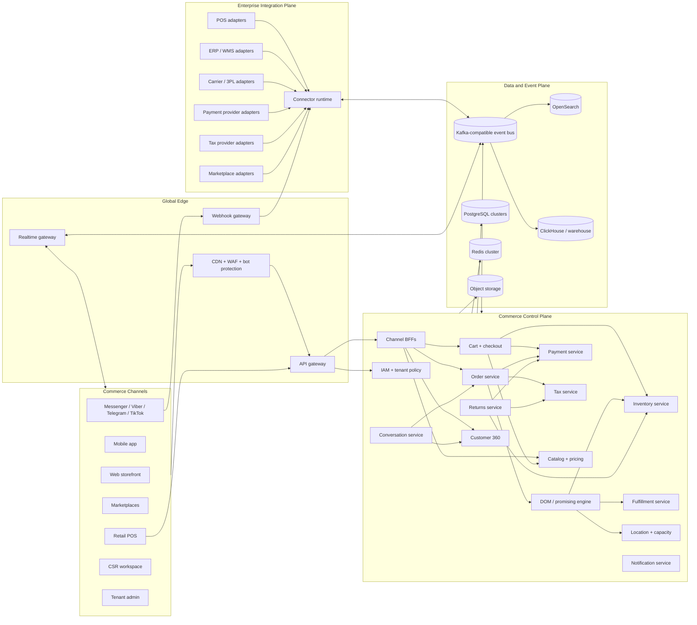
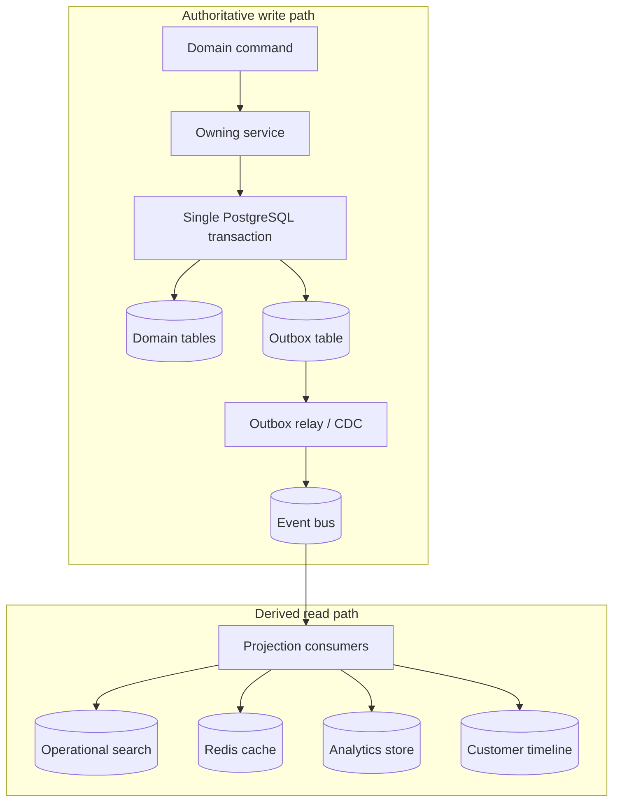
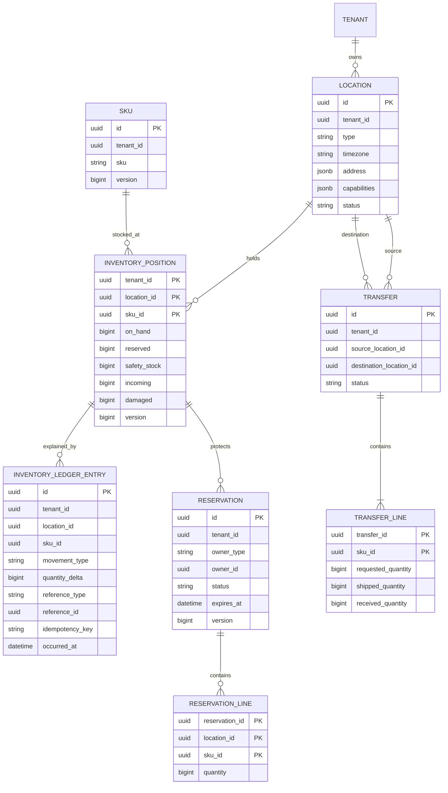
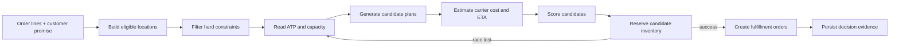
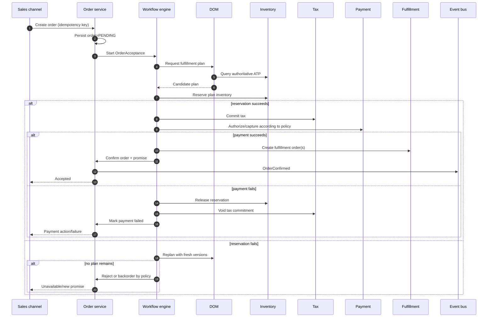
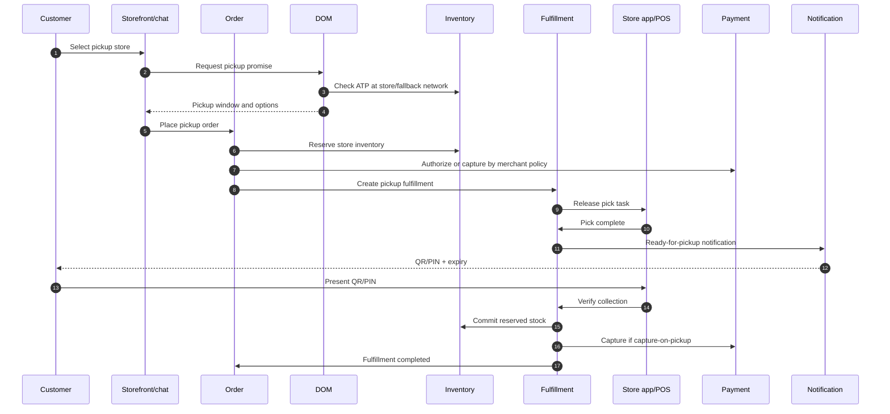
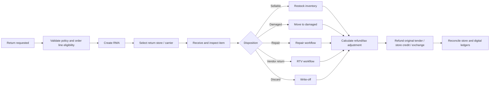
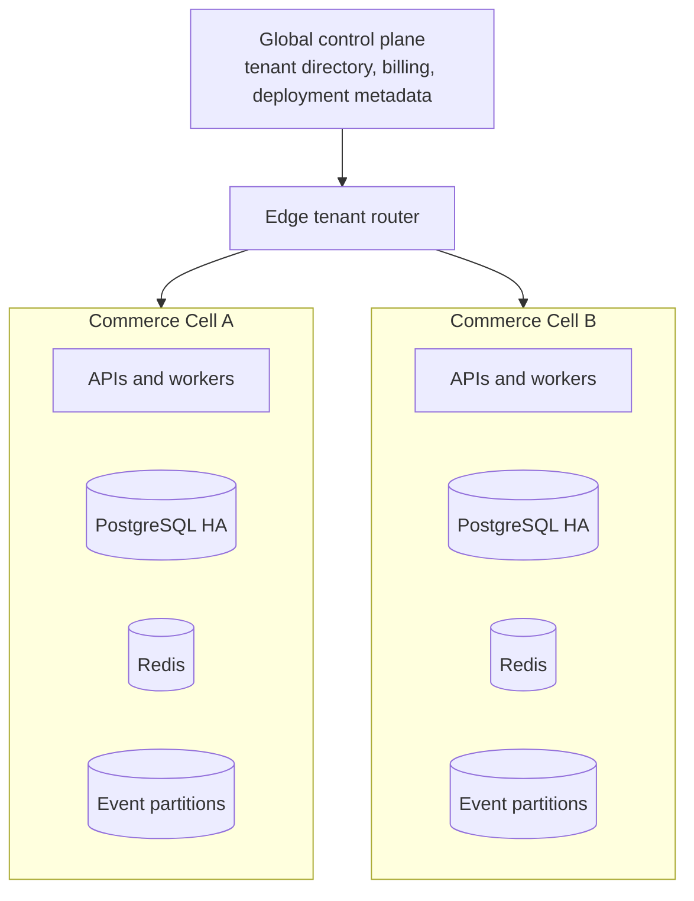
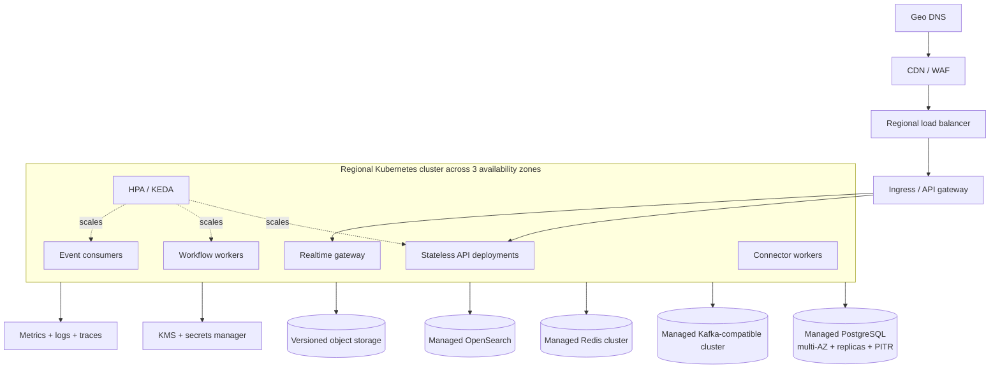

# Commerce OS Production Architecture

Status: target architecture  
Audience: product, engineering, platform, security, and operations  
Scope: multi-tenant zayos commerce, distributed order management, unified inventory, BOPIS, BORIS, payments, tax, and customer operations

## 1. Architecture Position

Commerce OS should become a headless, event-driven commerce operations platform. It should accept orders and inventory changes from any sales channel, make one authoritative availability decision, select the best fulfillment plan, and coordinate fulfillment, payment, tax, returns, and customer communication without requiring every system to be online at the same moment.

The architecture has four non-negotiable properties:

1. **Inventory correctness:** only the Inventory service can mutate stock state or create reservations.
2. **Workflow durability:** every long-running order, fulfillment, and return process is a persisted workflow with retries and compensation.
3. **Channel independence:** storefronts, POS systems, marketplaces, chat channels, and admin tools use the same commerce APIs and events.
4. **Incremental evolution:** the current NestJS core remains useful while domains are extracted behind stable APIs using a strangler migration.

This is the intended production shape:

- API-first and webhook-first at the edge.
- Strong consistency inside each domain boundary.
- Eventual consistency between domains.
- At-least-once event delivery with idempotent consumers.
- PostgreSQL as the transactional source of truth.
- Kafka-compatible event streaming for durable domain events.
- Redis for short-lived coordination, rate limits, cache, and realtime fan-out—not as a system of record.
- OpenSearch for operational search and ClickHouse or a warehouse for analytics.
- Object storage for media, exports, invoices, and immutable evidence.

## 2. System Context



## 3. Domain Boundaries and Ownership

These are logical services and ownership boundaries. Initially, several can run as modules in the current core deployment. A boundary should become a separately deployed service only when scale, reliability, release cadence, or team ownership justifies it.

| Domain | Owns | Must not own |
| --- | --- | --- |
| IAM and Tenant Policy | users, service identities, roles, tenant membership, store-scoped permissions | orders or customer business state |
| Catalog | products, variants, bundles, attributes, channel assortments | stock quantities |
| Pricing and Promotions | price books, promotions, coupons, eligibility, price calculation evidence | captured payments |
| Location | stores, warehouses, dark stores, capabilities, calendars, capacity, service areas | inventory quantities |
| Inventory | stock ledger, inventory positions, reservations, safety stock, ATP | order lifecycle |
| Cart and Checkout | carts, checkout sessions, selected delivery promise | final order authority |
| Order | immutable commercial order, revisions, line state, orchestration state | physical stock |
| DOM / Promising | sourcing rules, fulfillment options, plans, scoring decisions | inventory mutation |
| Fulfillment | fulfillment orders, pick/pack/ship/pickup tasks, shipments, carrier state | customer payment balance |
| Payment | intents, authorizations, captures, refunds, reconciliation, provider ledger | order item state |
| Tax | quotes, committed tax, refund adjustments, jurisdiction evidence | payment capture |
| Returns | return authorization, received items, disposition, exchange, refund instruction | direct stock edits |
| Customer 360 | customer identity graph, consent, timeline projections, segments | source order/payment records |
| Conversation | channel threads, messages, csr assignment, chat-to-order context | commerce truth |
| Integration | provider credentials, mappings, cursors, inbox/outbox, retries, DLQ | canonical domain state |
| Notification | templates, delivery attempts, preferences | workflow decisions |
| Analytics | read models, KPI facts, operational and business reporting | transactional writes |

## 4. Data Ownership and Storage



Rules:

- Each service owns its schema or database and is the only writer to it.
- A state change and its outbox event commit in the same database transaction.
- Consumers store an inbox/idempotency record before applying an event.
- Events use a versioned envelope with `event_id`, `tenant_id`, `aggregate_id`, `aggregate_version`, `correlation_id`, `causation_id`, `occurred_at`, and `schema_version`.
- Events are immutable. Corrections are new events.
- Personally identifiable information should be referenced by opaque IDs in broadly consumed events. Sensitive details belong in access-controlled domain APIs.
- Read models can be rebuilt from domain snapshots and retained events.

## 5. Unified Inventory Architecture

The current `products.stock_quantity` field must be replaced by location-aware inventory positions. Product/catalog data and stock data are separate domains.

### 5.1 Inventory Model



Quantities:

```text
ATP = on_hand - reserved - safety_stock - damaged
future_ATP = ATP + eligible_incoming
```

Important behavior:

- All quantities use integer base units, never floating point.
- Every mutation appends a ledger entry and updates the materialized position in one transaction.
- Reservation uses an atomic conditional update or row lock:

```sql
UPDATE inventory_position
SET reserved = reserved + :quantity,
    version = version + 1
WHERE tenant_id = :tenant
  AND location_id = :location
  AND sku_id = :sku
  AND (on_hand - reserved - safety_stock - damaged) >= :quantity;
```

- A zero-row update means the reservation lost the race; it must never silently oversell.
- Reservation expiry is processed by partitioned workers using `FOR UPDATE SKIP LOCKED`.
- Inventory feeds from POS/WMS are idempotent and ordered per `tenant + location + SKU`.
- Absolute stock counts create reconciliation adjustments; they do not erase ledger history.
- Availability APIs can use cached projections, but checkout reservation always reaches the authoritative Inventory service.

### 5.2 Inventory Consistency

| Operation | Consistency |
| --- | --- |
| Reserve stock during checkout/order acceptance | Strong |
| Commit reservation at fulfillment | Strong |
| Release reservation after cancellation/expiry | Strong |
| Product page availability badge | Eventual, cached |
| Store availability lookup before checkout | Read-your-writes where practical |
| Analytics and inventory history | Eventual |
| POS/WMS feed ingestion | Ordered and idempotent per location/SKU |

## 6. Distributed Order Management and Promising

DOM must produce an explainable fulfillment plan, not merely assign an order to an employee.

### 6.1 Planning Pipeline



Hard constraints:

- Location active and permitted for the sales channel.
- SKU stocked and sellable at location.
- Fulfillment capability supports ship, pickup, or transfer.
- ATP covers requested quantity unless split fulfillment is allowed.
- Store calendar, cutoff, handling time, and capacity permit the promise.
- Hazardous goods, temperature, geography, carrier, and tenant policy constraints pass.

Candidate strategies:

- Single-location fulfillment.
- Minimum-split fulfillment.
- Ship from warehouse.
- Ship from store.
- Pickup in store.
- Transfer-to-pickup location.
- Backorder or preorder.
- Partial accept, if tenant policy permits it.

An initial transparent scoring model:

```text
score =
    shipping_cost_weight    * normalized_shipping_cost
  + delivery_time_weight    * normalized_delivery_time
  + split_penalty           * shipment_count
  + store_load_weight       * capacity_utilization
  + margin_weight           * normalized_fulfillment_cost
  + inventory_risk_weight   * stockout_risk
  + priority_penalties
```

Lower score wins. Rules and weights are versioned per tenant and market. Every plan stores:

- Candidate locations considered.
- Rejection reasons.
- Input inventory versions.
- Capacity and cutoff observations.
- Carrier quote/ETA.
- Rule-set version and score components.
- Winning plan and fallback sequence.

This evidence is essential for support, merchant trust, simulation, and tuning.

### 6.2 Order Acceptance Saga

Use orchestration for the critical order path because the sequence and compensations must be visible.



Recommended workflow implementation: Temporal or an equivalent durable workflow engine. Kafka transports facts; it should not be forced to act as an implicit workflow engine for every multi-step transaction.

## 7. BOPIS Architecture

BOPIS is modeled as a fulfillment method with store operations, not as a shipping-address flag.

Required states:

```text
PLANNED
  -> RESERVED
  -> RELEASED_TO_STORE
  -> PICKING
  -> READY_FOR_PICKUP
  -> CUSTOMER_ARRIVED (optional)
  -> PICKED_UP

Terminal/exception:
CANCELLED, EXPIRED, NOT_FOUND, PARTIALLY_AVAILABLE
```



Controls:

- Signed, short-lived pickup QR/PIN with replay protection.
- Authorized pickup-person records.
- Configurable hold period and automatic expiry.
- Store-level pick SLA and capacity.
- Not-found workflow that can re-source, transfer, substitute, or cancel.
- Payment policy supports pay-now, authorize-now/capture-at-pickup, and pay-at-store.

## 8. BORIS and Returns Architecture

A return is a first-class aggregate. Never model it only by changing `order.status` to `returned`.



Core return records:

- Return authorization and policy snapshot.
- Original order and line references.
- Requested and accepted quantities.
- Return channel and receiving location.
- Reason, condition, inspection evidence, and disposition.
- Refund allocation across tenders.
- Tax adjustment evidence.
- Restocking fee, shipping deduction, and appeasement.
- Exchange order linkage.
- Inventory movement references.

Cross-location behavior:

- The receiving store records custody immediately.
- Inventory is not sellable until inspection disposition says so.
- The Returns service requests an Inventory movement; it does not edit stock.
- The Payment service refunds the original tender where possible and records provider reconciliation.
- The Tax service creates a return adjustment for the original jurisdiction.
- Finance receives inter-location settlement facts when the seller, fulfiller, and return location differ.

## 9. API and Event Contracts

### 9.1 API Style

- External APIs: versioned REST/JSON first, with OpenAPI and generated SDKs.
- Internal high-volume synchronous calls: REST or gRPC; use gRPC only where it materially improves throughput or contract safety.
- Async integration: versioned domain events through Kafka-compatible topics.
- Bulk inventory import: object-storage upload plus asynchronous job, not giant synchronous requests.
- Every mutating API accepts an `Idempotency-Key`.
- Every response includes `request_id`; asynchronous workflows expose `operation_id`.
- Use optimistic concurrency with an aggregate `version` or ETag.

Example reservation command:

```json
{
  "tenantId": "tenant_123",
  "ownerType": "ORDER",
  "ownerId": "order_456",
  "expiresAt": "2026-06-20T12:30:00Z",
  "lines": [
    {
      "skuId": "sku_789",
      "locationId": "store_001",
      "quantity": 2,
      "expectedInventoryVersion": 1842
    }
  ]
}
```

Example event envelope:

```json
{
  "eventId": "01J...",
  "eventType": "inventory.reservation.created.v1",
  "tenantId": "tenant_123",
  "aggregateId": "reservation_456",
  "aggregateVersion": 1,
  "correlationId": "order_456",
  "causationId": "command_789",
  "occurredAt": "2026-06-20T12:00:00Z",
  "producer": "inventory-service",
  "data": {}
}
```

### 9.2 Topic Families

```text
catalog.product.*
location.*
inventory.position.*
inventory.reservation.*
inventory.movement.*
order.*
dom.plan.*
fulfillment.*
payment.*
tax.*
return.*
customer.*
conversation.*
integration.*
```

Partition keys:

- Inventory movement: `tenant_id + location_id + sku_id`.
- Order and fulfillment: `tenant_id + order_id`.
- Customer timeline: `tenant_id + customer_id`.

These keys preserve useful local ordering without claiming global ordering.

## 10. Multi-Tenancy

Default SaaS model:

- Every record and event contains `tenant_id`.
- PostgreSQL row-level security provides defense in depth in addition to application guards.
- Tenant context is established from a verified token, never trusted from an arbitrary request body.
- Cache, search, object storage, rate limits, and event keys are tenant namespaced.
- Service-to-service identities use workload identity and short-lived credentials.
- Enterprise tenants can be promoted to dedicated database/schema, event namespace, encryption key, or deployment cell.

Use cell-based architecture at scale:



A cell limits blast radius and gives a practical path from hundreds to thousands of tenants without one global transactional database becoming the platform.

## 11. Production Deployment

Cloud-neutral Kubernetes layout:



Production requirements:

- Three availability zones for stateless workloads and managed data services.
- Pod disruption budgets, topology spread constraints, anti-affinity, and graceful shutdown.
- Horizontal scaling by CPU/latency for APIs and by queue lag for consumers/workers.
- Separate node pools for APIs, workflow workers, connector workloads, and heavy media jobs.
- PostgreSQL connection pooling through PgBouncer.
- Point-in-time recovery, cross-region backups, quarterly restoration drills.
- Kafka topic replication across zones and monitored consumer lag.
- Blue/green or canary releases with automatic rollback on SLO regression.
- Expand/contract database migrations; never require simultaneous deployment of all consumers.

Recommended first production region for the current market is a nearby Southeast Asia region with acceptable provider coverage and latency. Add a second region for disaster recovery before claiming enterprise-grade continuity. Active/passive is the sensible first step; active/active writes should wait until the business truly requires their complexity.

## 12. Reliability Targets

Initial competitive SLOs:

| Capability | Target |
| --- | --- |
| Availability lookup | 99.95%, p95 under 150 ms from regional edge |
| Inventory reservation | 99.95%, p95 under 300 ms |
| Order submission acknowledgment | 99.95%, p95 under 500 ms excluding external payment challenge |
| Order workflow completion | 99.9% within 60 seconds when providers are healthy |
| Webhook acceptance | 99.99%, acknowledge after durable persistence |
| Admin/csr APIs | 99.9%, p95 under 400 ms |
| Inventory event propagation to channels | p95 under 2 seconds |
| RPO | under 5 minutes initially; zero for committed multi-AZ database writes |
| Regional RTO | under 60 minutes initially, progressing toward 15 minutes |

Reliability patterns:

- Timeouts on every network call.
- Bounded exponential retry with jitter.
- Circuit breakers for unstable providers.
- Bulkheads per tenant and connector.
- Dead-letter queues with replay tooling.
- Poison-message quarantine.
- Idempotency for commands, events, webhooks, and provider callbacks.
- Reconciliation jobs for inventory, payments, shipments, and tax.
- Backpressure and tenant-aware rate limits.
- Load shedding that protects checkout, reservation, and order writes before reports and exports.

## 13. Security and Compliance

- OIDC/OAuth 2.1 for human and machine identities.
- Short-lived access tokens with refresh rotation.
- Fine-grained permissions scoped by tenant, brand, store, warehouse, and action.
- MFA and step-up authentication for refunds, exports, credential changes, and high-value adjustments.
- TLS everywhere; mutual TLS or workload identity inside the cluster.
- Envelope encryption with managed KMS keys.
- Provider credentials stored in a secrets manager, never tenant JSON or environment files.
- Tokenize payment instruments; keep card data out of Commerce OS to reduce PCI scope.
- Immutable audit trail for permission changes, inventory adjustments, refunds, order revisions, and exports.
- PII classification, consent, retention, export, and erasure workflows.
- Signed webhooks with timestamp/replay validation.
- Software supply-chain controls: lockfiles, SBOM, dependency scanning, signed images, admission policy, and provenance.

## 14. Observability and Operations

Use OpenTelemetry across HTTP, workflows, events, database calls, and provider connectors.

Required correlation fields:

```text
trace_id
request_id
tenant_id
user_id / service_identity
order_id
fulfillment_id
reservation_id
return_id
provider
event_id
workflow_id
```

Operational dashboards:

- Order acceptance success and latency by channel/tenant.
- Inventory reservation conflict and oversell-prevention rates.
- Inventory feed lag and reconciliation drift.
- DOM candidate count, sourcing outcome, split rate, cost, and fallback rate.
- BOPIS pick SLA, not-found rate, expiry rate, and collection time.
- Return cycle time, disposition, refund lag, and reconciliation exceptions.
- Payment authorization/capture/refund success by provider.
- Workflow retries, stuck workflows, DLQ depth, and event consumer lag.
- Database saturation, slow queries, lock waits, and connection pool pressure.

Every critical workflow needs an operator page that answers:

- What state is it in?
- Why is it there?
- What was attempted?
- What will retry automatically?
- What safe manual actions are available?

## 15. Capacity and Scaling Model

Do not size only by total orders. Size by peak write amplification:

```text
peak order rate
× average lines per order
× candidate locations evaluated
× inventory mutations per line
× emitted events and projections
```

Illustrative design checkpoint—not a promise without load testing:

- 10,000 tenants.
- 5,000 active locations.
- 10 million SKUs across tenants.
- 2,000 order submissions/second at campaign peak.
- 20,000 inventory updates/second.
- 100,000 availability reads/second, mostly served by projections/cache.

Scaling controls:

- Partition inventory and event traffic by tenant/location/SKU.
- Keep reservation writes narrow and index-local.
- Batch feed ingestion while preserving per-key order.
- Use read replicas only for stale-tolerant reads.
- Precompute nearby eligible locations and carrier zones.
- Cache DOM reference data, never authoritative reservation outcomes.
- Move “whale” tenants into dedicated cells before they distort shared capacity.

## 16. Evolution From the Current Repository

Do not start with a full rewrite. Use the existing NestJS core as a modular monolith and establish the seams first.

### Phase 0 — Correct the Foundation

- Keep the existing dashboards and APIs.
- Introduce API idempotency and optimistic aggregate versions.
- Add transactional outbox and consumer inbox tables.
- Replace in-process-only domain event publishing with a durable event relay.
- Add OpenTelemetry, structured correlation IDs, and production secrets management.
- Rename the current csr assignment UI from “Order Routing” to “Work Assignment” to avoid confusing it with DOM.

### Phase 1 — Location and Unified Inventory

- Add Location as a first-class domain.
- Build Inventory Position, Ledger, Reservation, Transfer, and Adjustment modules.
- Stop treating `products.stock_quantity` as authoritative.
- Integrate one POS or WMS feed using durable inbox/idempotency.
- Expose ATP and reservation APIs.
- Project aggregate availability back to existing product screens.

Deploy this first as an independently owned module in the core if necessary, but give it separate tables and no cross-domain writes.

### Phase 2 — Order Orchestration and DOM

- Make Order a clean aggregate with line-level states and revisions.
- Add a durable workflow engine.
- Build fulfillment options, fulfillment plans, sourcing policies, and decision evidence.
- Start with deterministic rules: eligibility, ATP, distance, cost, capacity, and minimum splits.
- Create Fulfillment Order as a separate aggregate.
- Pilot ship-from-warehouse, then ship-from-store.

### Phase 3 — BOPIS

- Add store fulfillment app/POS endpoints.
- Add pickup windows, store capacity, pick tasks, ready notification, QR/PIN handoff, and expiry.
- Add re-source/not-found handling.
- Certify the complete workflow under duplicate events, delayed feeds, and provider outages.

### Phase 4 — BORIS, Payments, and Tax

- Add first-class Return/RMA and item disposition.
- Add provider-backed authorization, capture, refund, and reconciliation ledger.
- Add tax quote/commit/refund interfaces and jurisdiction evidence.
- Support return-to-any-store and exchange orders.
- Add finance exports and cross-location settlement facts.

### Phase 5 — Cell Scale and Ecosystem

- Split the hottest or highest-risk domains into independently deployed services: Inventory, Workflow/DOM, Integration, and Payment first.
- Introduce tenant cells and placement automation.
- Publish partner APIs, SDKs, connector certification, and a sandbox.
- Add multi-region disaster recovery and enterprise isolation tiers.

## 17. Extraction Decision Test

Extract a module into a service only when at least one is true:

- It needs independent scaling.
- It needs a different availability or security boundary.
- Its release cadence blocks other teams.
- Its data ownership is already clean and stable.
- Provider failures need a separate blast radius.
- A dedicated team owns it end to end.

Inventory, connector ingestion, workflows/DOM, and payment are the first likely extractions. Catalog administration and basic tenant settings can remain in the modular core much longer.

## 18. Architectural Decisions to Record

Create ADRs before implementation for:

1. Event platform selection and retention.
2. Workflow engine selection.
3. Inventory concurrency and reservation expiry semantics.
4. Tenant isolation and cell placement.
5. Order/payment capture policy.
6. DOM rule representation and versioning.
7. Tax provider abstraction and fallback.
8. Search and analytics stores.
9. Regional deployment and disaster recovery.
10. Event schema governance and compatibility.

## 19. Definition of “Market-Competitive”

Commerce OS should not claim DOM, unified inventory, BOPIS, or BORIS merely because corresponding statuses exist. A capability is production-ready only when:

- The domain model exists and has one authoritative owner.
- Mutations are concurrency-safe and idempotent.
- The happy path and compensating path are durable.
- External integrations reconcile after missed or duplicate messages.
- Operators can diagnose and safely recover failures.
- Tenant isolation and permissions are enforced.
- SLOs, load tests, disaster recovery, and security controls are verified.
- The workflow is tested across web, POS, store, csr, and provider boundaries.

That bar is demanding. It is also the difference between a dashboard with commerce vocabulary and a Commerce OS that retailers can safely run.

## 20. Reference Benchmarks

The architecture is original to Commerce OS, but its capability bar is calibrated against public technical documentation from established commerce and cloud platforms:

- [Shopify inventory levels and locations](https://shopify.dev/docs/apps/build/orders-fulfillment/inventory-management-apps/manage-quantities-states)
- [Shopify fulfillment solutions](https://shopify.dev/docs/apps/build/orders-fulfillment/order-management-apps/build-fulfillment-solutions)
- [commercetools inventory and reservations](https://docs.commercetools.com/api/projects/inventory)
- [commercetools store modeling](https://docs.commercetools.com/api/projects/stores)
- [Fluent Commerce intelligent order sourcing](https://docs.fluentcommerce.com/by-type/UC-A-replenishment-Order)
- [AWS transactional outbox pattern](https://docs.aws.amazon.com/prescriptive-guidance/latest/cloud-design-patterns/transactional-outbox.html)
- [AWS saga orchestration pattern](https://docs.aws.amazon.com/prescriptive-guidance/latest/cloud-design-patterns/saga-orchestration.html)
- [AWS strangler fig migration pattern](https://docs.aws.amazon.com/prescriptive-guidance/latest/cloud-design-patterns/strangler-fig.html)
