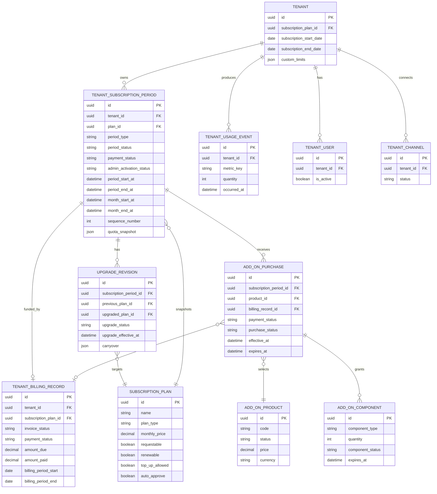
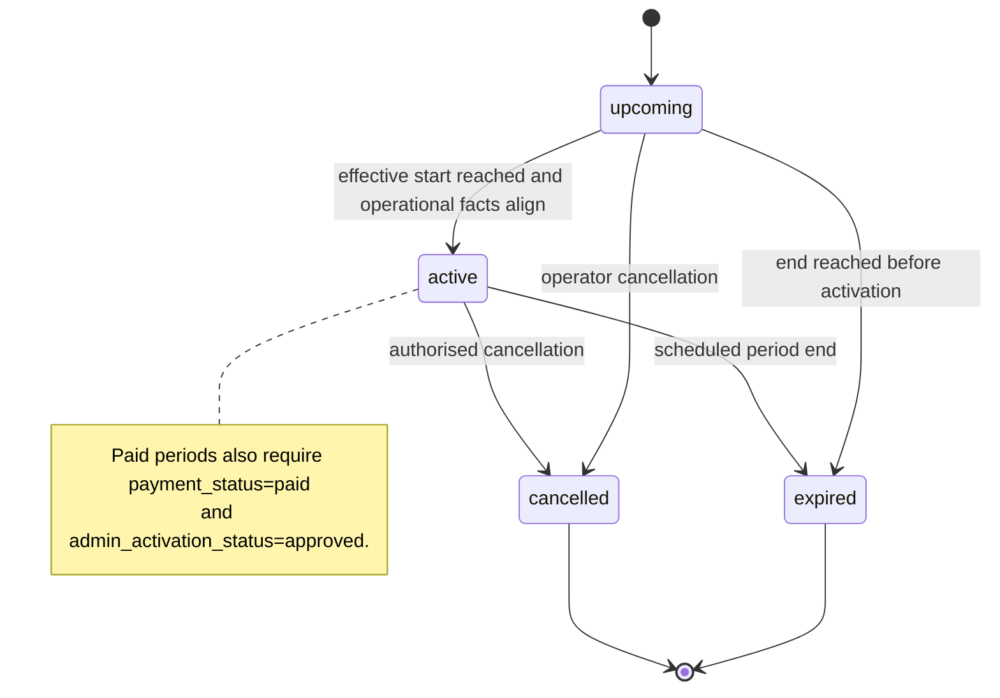
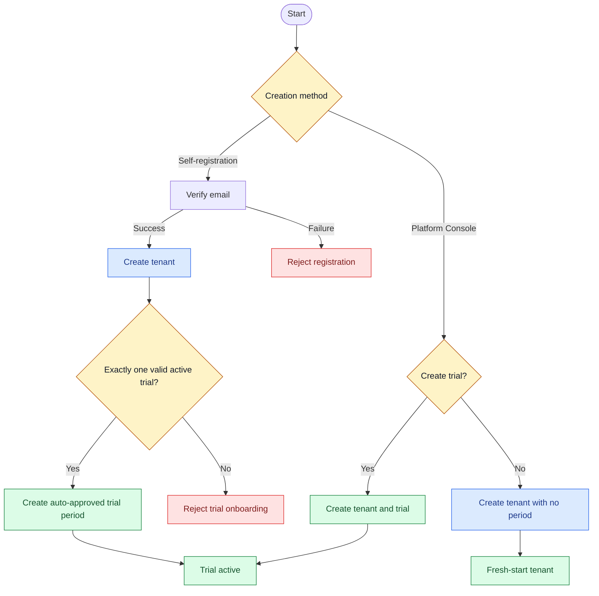
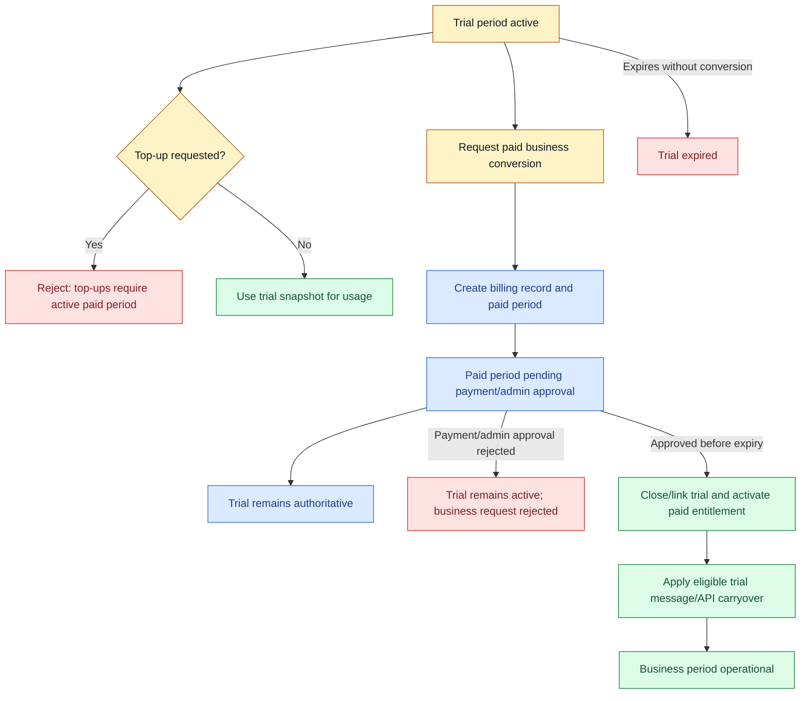
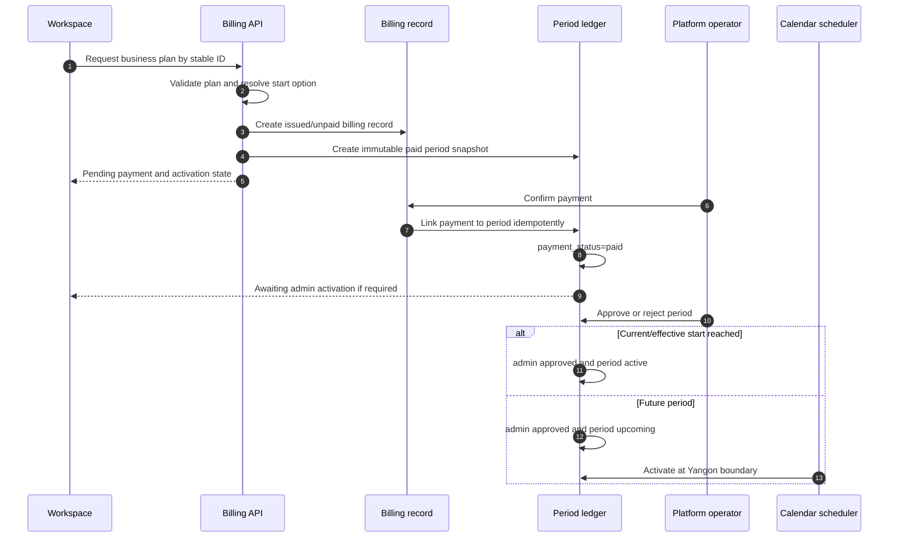
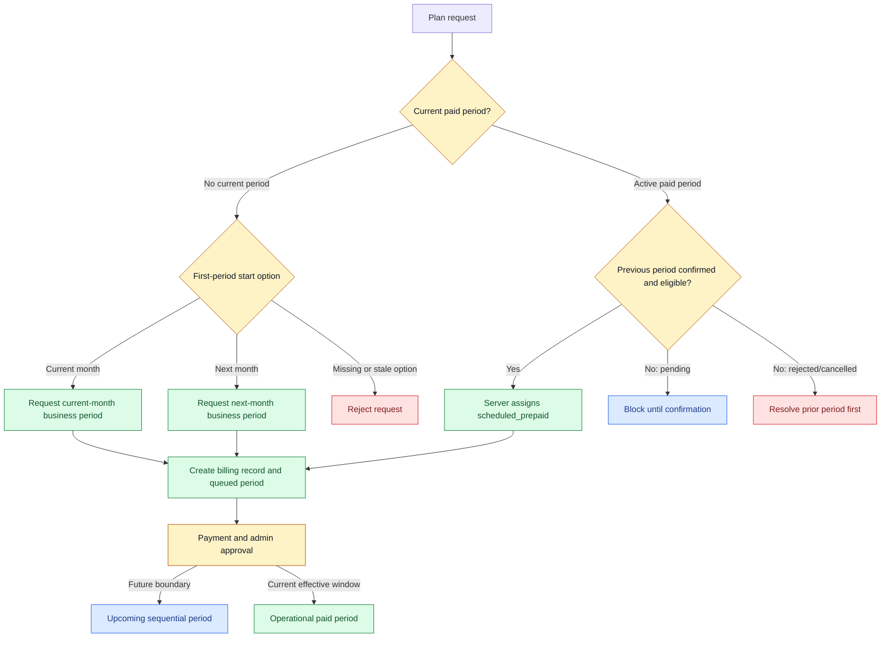
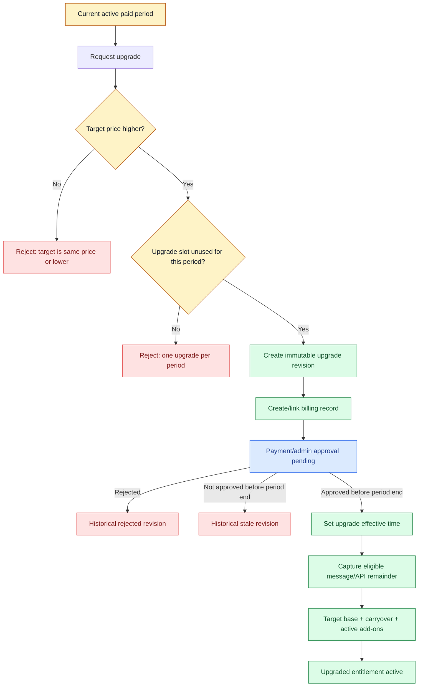
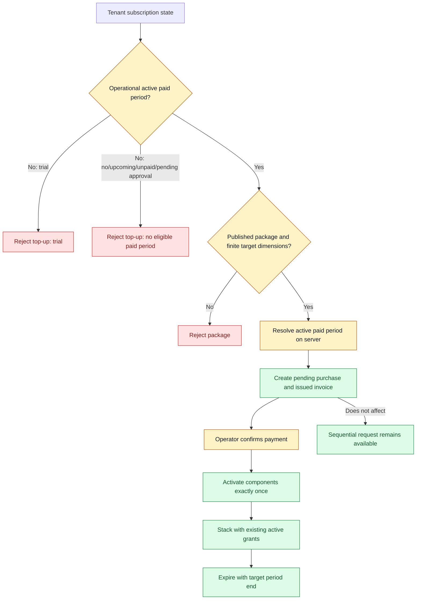
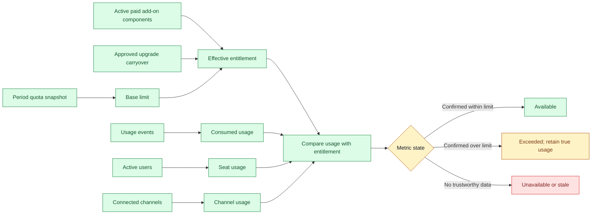
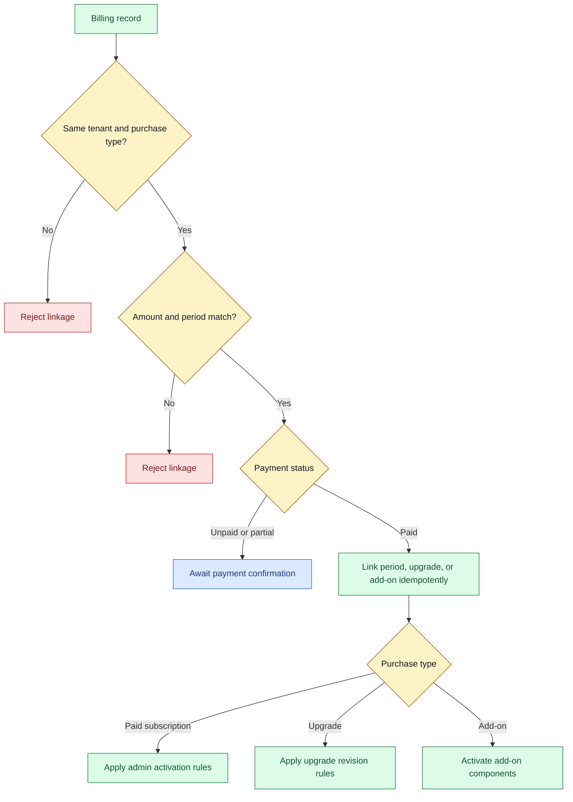

# ZayOS Plan & Billing Module

**Status:** Canonical module specification  
**Last updated:** 2026-08-24  
**Scope:** subscription plans, tenant subscription periods, trials, paid activation, upgrades, sequential periods, add-on packages, usage entitlements, billing records, payment confirmation, authorization, and acceptance scenarios

This is the single source of truth for the Plan & Billing module. All Mermaid diagrams are embedded in this Markdown document so the document can be rendered directly by any Markdown viewer with Mermaid support.

## 1. Purpose and product boundary

The module provides the commercial control plane for ZayOS tenants:

- define the canonical subscription-plan catalog;
- provision trial or paid subscription periods;
- control which period is operational at a given instant;
- record invoice and payment evidence;
- apply plan changes and one-time upgrades safely;
- sell period-bound add-on packages;
- calculate usage against immutable period entitlements;
- expose the same billing truth to Workspace and Platform Console users.

This release uses operator-confirmed billing and payment records. It does **not** include automatic payment-gateway reconciliation, generated PDF invoices, refunds for add-on purchases, or automatic recurring payment collection.

### 1.1 Terms

| Term | Meaning |
| --- | --- |
| Plan | A catalog record describing price, limits, provider access, and commercial/public metadata. |
| Trial plan | A one-time, auto-approved plan used for an exact elapsed-day trial period. |
| Business plan | A paid plan using Yangon calendar-month billing windows. |
| Period | A tenant's purchased or trial entitlement window. Its quota snapshot is frozen at creation. |
| Current period | The period whose effective window contains the current instant. |
| Upcoming period | A confirmed future period waiting for its scheduled boundary. |
| Upgrade | A higher-priced plan revision applied to the current paid period after payment and admin approval. |
| Sequential period | A future paid period queued after an eligible previous period. |
| Add-on package | A published, period-bound bundle of extra quota or capacity. The UI may call this an add-on package or top-up. |
| Operational | A period is calendar-active, paid when required, admin-approved, and inside its half-open effective window. |
| Carryover | Remaining inbound-message, outbound-message, and API quota transferred once during an approved upgrade. |

## 2. Canonical entities and ownership

The backend entities below are authoritative. Display names, fixture data, and client-selected plan names are never commercial identity.

| Entity | Authority and responsibility |
| --- | --- |
| `subscription_plans` | Catalog identity, price, base limits, provider access, plan type, and public metadata. Stable identity is `id`; a stable code may be used as an external reference. |
| `tenants` | Current tenant assignment and tenant-level overrides such as `subscriptionPlanId`, custom CSR/channel/message/API limits, and compatibility billing dates. |
| `tenant_subscription_periods` | Authoritative purchased/trial quota window, status, payment state, admin activation state, sequence, immutable quota snapshot, and trial conversion linkage. |
| `subscription_period_upgrade_revisions` | Immutable one-upgrade-per-current-period record containing previous/target plan snapshots, status, effective time, and eligible carryover. |
| `tenant_billing_records` | Canonical invoice and payment-confirmation records for subscription and add-on billing. |
| `tenant_subscription_add_on_purchases` | Immutable purchase ledger for a package attached to exactly one tenant and one paid period. |
| `tenant_subscription_add_on_components` | Active component grants produced by a confirmed add-on purchase. |
| `tenant_usage_events` | Persisted inbound/outbound provider-message and API-request consumption. |
| `tenant_users` | Live active-seat count for team-member limits. |
| `tenant_channels` | Live connected-channel count for channel limits. |
| Period and add-on event tables | Append-only commercial history for creation, payment confirmation, approval, activation, cancellation, expiry, and grants. |



### 2.1 Core invariants

1. A tenant has one canonical current assignment in `tenants.subscriptionPlanId`; Workspace users cannot mutate it directly.
2. A period stores an immutable quota snapshot. Later edits to the plan catalog do not rewrite purchased terms.
3. A tenant can have at most one active paid period and at most one active trial period. A trial and a paid conversion may coexist while the paid period awaits admin approval; the trial remains authoritative until approval.
4. A paid period is operational only when its payment, calendar, and admin-approval facts all align.
5. Every confirmed billing record links to at most one period or add-on purchase according to its purchase type.
6. Every add-on purchase belongs to one tenant and one server-resolved active paid period. The client cannot select an arbitrary target period.
7. Repeated requests with the same idempotency key return the stored result and never grant a second period, upgrade, or add-on.
8. `null` means unlimited for quota dimensions; `0` means blocked. A large synthetic number must not represent unlimited.
9. No usage event is treated as a confirmed zero when the metric is unavailable or stale. The current API exposes freshness, but stronger stale-vs-zero signaling remains a launch follow-up.

## 3. Plan catalog

### 3.1 Plan identity and types

- `subscription_plans.id` is the immutable internal identity.
- Public pricing and signup use a stable plan ID or stable plan code, never a display-name match.
- Unknown or inactive plan IDs/codes are rejected; the server does not silently choose the cheapest plan.
- Exactly one active trial plan is expected for automatic trial onboarding. Missing, malformed, or multiply configured active trial plans fail closed.
- `business` plans use Yangon calendar months. Their legacy `durationDays` value is not used to determine a monthly boundary.
- `trial` plans use `durationDays` as a positive exact elapsed-day duration.

### 3.2 Commercial fields

| Field | Rule |
| --- | --- |
| `planType` | `business` or `trial`. |
| `monthlyPrice` | Price snapshot source for a paid period; currency is currently MMK unless the catalog says otherwise. |
| `maxCsrs` | Base active-team-member capacity. No team-member add-on exists in the current package catalog. |
| `maxChannels` | Base connected-channel capacity. Channel-slot packages may add capacity. |
| `inboundMessageLimit` | Monthly inbound-message quota; `null` unlimited, `0` blocked. |
| `outboundMessageLimit` | Monthly outbound-message quota; `null` unlimited, `0` blocked. |
| `apiLimit` | Monthly API-request quota; `null` unlimited, `0` blocked. |
| `storageLimitGb` | Base storage capacity; storage packages may add capacity. |
| `allowedProviders` | Provider/channel access frozen into the purchased period snapshot. |
| `features` | Boolean, commercial, and public metadata. Public projection reads `features.public`. |
| `status` | `active`, `inactive`, or `archived`. Only active catalog records are selectable for new purchases. |

Trial plans must be non-requestable, non-renewable, top-up-ineligible, and auto-approved. They are not paid invoices and use period payment status `not_required`.

### 3.3 Public projection

The public catalog may expose only approved fields such as name, description, price, limits, summary, CTA, recommended, self-serve, and visibility. `recommended` and `selfServe` are fail-closed to `false` when absent. Commercial behavior is never inferred from a plan name.

## 4. Period and calendar model

### 4.1 Business periods

- Business periods use the `Asia/Yangon` calendar-month boundary.
- A calendar window is half-open: `[monthStartAt, monthEndAt)`.
- For normal monthly periods, `periodStartAt === monthStartAt` and `periodEndAt === monthEndAt`.
- A first current-month purchase may be activated during the open month.
- A future prepaid period stays upcoming until its scheduled Yangon boundary.
- A paid period scheduled directly after a trial may use the exact trial expiry as its effective `periodStartAt` while retaining the Yangon calendar window metadata.
- `activatedAt` records the actual activation instant and may differ from the effective period start.

### 4.2 Trial periods

- Trial periods use exact elapsed-day bounds `[periodStartAt, periodEndAt)`.
- Trial periods do not use Yangon calendar-month fields.
- A trial has no billing record, has payment status `not_required`, and is auto-approved.
- A trial expires exactly at `periodEndAt`; there is no automatic grace window or renewal.

### 4.3 Period status versus operational status

These are separate facts:

- calendar period status: `upcoming`, `active`, `expired`, `cancelled`;
- payment status: `pending`, `paid`, `failed`, `refunded`, `not_required`;
- admin activation: `pending`, `approved`, `revoked`.

For a paid period, `operational = active && paid && approved && now in [periodStartAt, periodEndAt)`. A future approved period remains `upcoming` until its boundary. A paid but pending-approval period is not operational.



## 5. Merchant creation and onboarding

There are two supported creation paths:

1. **Self-registration:** verify email, create tenant, resolve the single active trial plan, and create one active trial period. A missing or invalid trial configuration fails onboarding rather than silently creating an arbitrary plan.
2. **Platform Console creation:** the operator chooses whether to create a tenant with a trial or with no period. A no-period tenant starts in fresh-start state and may request a current-month business plan.



## 6. Trial lifecycle and conversion

### 6.1 Trial rules

- Trial top-ups are rejected.
- Trial usage is calculated from the trial's frozen quota snapshot.
- While a paid conversion is pending, the trial remains authoritative for usage and UI display.
- The Workspace must show both facts clearly: `Trial active` and `Business plan awaiting approval`.
- A trial may be converted into a paid business period. The trial-to-paid linkage is stored on both period records.
- When the conversion is approved, the trial is closed according to the conversion transition and eligible trial message/API quota is carried into the new paid entitlement.
- Trial limits are not carried into an unrelated fresh-start period after the trial.
- A fresh paid period after trial may start at exact trial expiry. It may be approved before or after that effective start, but it cannot activate after its end.



## 7. Paid plan purchase and activation

A paid plan purchase follows this sequence:

1. Select an active, requestable business plan by stable identity.
2. Resolve the start option on the server.
3. Create the billing record and period atomically where applicable.
4. Confirm payment by updating the billing record.
5. Create or reuse the linked paid period idempotently.
6. Set admin activation to `pending` for newly confirmed business purchases unless the plan is explicitly auto-approved.
7. Platform Admin approves or rejects the period with an actor, timestamp, reason, and event.
8. The calendar scheduler activates an approved upcoming period at its boundary.

A payment confirmation alone does not make a pending paid period operational when administrative approval is required.



## 8. Start options and sequential periods

### 8.1 Start options

| Start option | Meaning | Server rule |
| --- | --- | --- |
| `current_month` | First paid period becomes eligible in the currently open Yangon month. | Allowed only when there is no active paid period and the request is not stale. |
| `next_month` | First paid period is scheduled for the next Yangon month. | Confirmation rejects a stale quote whose target boundary has passed. |
| `scheduled_prepaid` | A future paid period queued behind an active paid period or after a trial. | Server-assigned; clients cannot override it. |

### 8.2 Sequential request prerequisites

- A tenant without a current period may request a current-month business plan.
- A tenant without an active paid period may request a future first period with `next_month`.
- A tenant with an active paid period may request a sequential business period; the server assigns `scheduled_prepaid`.
- A previous period must be confirmed/approved according to the applicable flow before another sequential request is accepted.
- A pending or rejected previous period blocks the next dependent request.
- A pending upgrade on the current period does not by itself create a separate sequential period; the sequential request follows the confirmed period queue rules.
- Each queued period has its own billing record, sequence number, immutable plan snapshot, and approval/payment state.



## 9. Upgrade rules

An upgrade is a revision of the current paid period, not an overwrite of the original period.

### 9.1 Eligibility

- A current active paid period is required.
- The target must be a higher-priced business plan.
- Same-price and lower-priced targets are rejected.
- At most one upgrade revision is allowed per current paid period, including rejected, stale, and cancelled historical revisions according to the one-upgrade-per-period policy.
- The upgrade must be requested and approved before the current period ends.
- A trial conversion is represented by the paid conversion flow and trial linkage; it is not a reason to permit arbitrary repeated upgrades.
- An upgrade applies only to the current active month. It does not rewrite already queued sequential periods.

### 9.2 Upgrade accounting

The revision records:

- previous and target plan IDs;
- immutable snapshots of both plans;
- request and effective timestamps;
- approval/rejection reason and actor;
- remaining eligible quota at approval;
- billing-record linkage;
- upgrade lifecycle status.

On approval, the effective entitlement is:

```text
Target plan snapshot
+ one-time remaining inbound-message carryover
+ one-time remaining outbound-message carryover
+ one-time remaining API-request carryover
+ existing valid active add-on components
```

Storage, channel, and team-member dimensions receive existing add-ons only; they do not receive upgrade carryover. An unlimited target dimension remains unlimited.



### 9.3 Upgrade states

`requested → pending_payment → pending_approval → approved` is the normal path. Terminal historical states are `rejected`, `stale`, and `cancelled`. Terminal revisions remain audit evidence and consume the period's upgrade slot.

## 10. Add-on packages / top-ups

### 10.1 Catalog

An add-on product is a published bundle with one or more components:

- `inbound_messages`
- `outbound_messages`
- `api_requests`
- `channel_slots`
- `storage_gb`

The product catalog grants nothing until a purchase is paid and activated. Product name, price, currency, and components are snapshotted on purchase.

### 10.2 Eligibility and stacking

- Only an operational active paid period is eligible.
- Trial periods, no-period tenants, upcoming periods, expired periods, unpaid periods, and admin-approval-pending periods are ineligible.
- The server resolves the target active paid period. A client-supplied period ID must match that resolution or the request is rejected.
- Multiple purchases of the same or different package are allowed in the same active period; there is no purchase-count cap in the current business rule.
- A package may not be purchased for an unlimited base dimension because it is unnecessary.
- A pending purchase creates a matching issued/unpaid billing record in the same transaction when no record was supplied.
- Payment confirmation activates the package exactly once and does not activate or alter the subscription period.
- A package expires at the target period's exclusive end time. Paid purchases cannot be cancelled in this release because refunds are not supported.
- Add-on purchases do not block sequential-period requests.



### 10.3 Add-on purchase states

`pending → active → expired` is the normal path. A pending purchase may become `cancelled` before payment confirmation. A paid purchase cannot be cancelled in the current release. Payment and purchase status are separate facts and both must be valid for an active grant.

## 11. Usage and effective-limit calculation

### 11.1 Metric sources

| Metric | Source | Freshness |
| --- | --- | --- |
| Inbound messages | Persisted `tenant_usage_events`. | Near real time. |
| Outbound messages | Persisted `tenant_usage_events`. | Near real time. |
| API requests | Persisted `tenant_usage_events`. | Near real time. |
| Active team members | Active `tenant_users`. | Live count. |
| Connected channels | Active/connected `tenant_channels`. | Live count. |
| Storage | Current storage implementation and its usage source. | Must expose honest freshness/availability. |

Usage responses expose `period.start`, `period.end`, `refreshedAt`, and the latest event timestamp where applicable. They must distinguish `unlimited`, `available`, `stale`, and `unavailable` rather than displaying a synthetic zero or a synthetic huge limit.

### 11.2 Limit resolution

For ordinary tenant limits:

```text
custom tenant override
→ assigned plan limit
→ null (unlimited or unconfigured)
```

For a purchased period, runtime quota enforcement uses the immutable period snapshot plus valid active add-on components. Catalog edits do not change a purchased period.

For a successfully approved upgrade:

```text
base target snapshot
+ eligible one-time message/API carryover
+ active add-on components
```

A finite quota may be exceeded by actual usage; percentage displays must clamp only the visual percentage, not the underlying usage value.



## 12. Billing records and payment states

### 12.1 Subscription billing

A subscription billing record may represent a paid plan period or an upgrade. It includes:

- tenant and optional plan identity;
- invoice number where available;
- billing-period start/end dates;
- invoice status: `draft`, `issued`, or `void`;
- payment status: `unpaid`, `partially_paid`, `paid`, `overdue`, or `waived`;
- amount due, amount paid, currency, due date, paid timestamp, notes, and metadata.

A confirmed payment is linked idempotently to the appropriate period or upgrade revision. A period is not operational merely because a billing record exists.

### 12.2 Add-on billing

A top-up/add-on billing record is issued against the active target period and contains metadata identifying:

- purchase type `top_up`;
- product ID/code;
- subscription period ID;
- amount and currency;
- purchase linkage and idempotency key.

The package is granted only after the record is confirmed paid and same-tenant/period linkage validation succeeds.

### 12.3 Payment confirmation flow



## 13. Authorization and audit boundaries

### Workspace billing roles

Workspace billing and plan-change APIs are limited to tenant billing roles:

- `owner`
- `admin`
- `supervisor`
- `finance`

These users may view their tenant's plan, periods, usage, billing records, and request a permitted plan change. They may not directly assign `tenants.subscriptionPlanId`, approve their own paid period, or confirm operator payment unless an explicit backend role allows it.

### Platform roles

Platform billing, usage, plan catalog, period approval, payment confirmation, and tenant plan operations remain platform-admin scoped through controller role guards. The UI should make finance versus operations permissions explicit, but backend authorization is the final boundary.

### Tenant isolation

Every read and mutation must be tenant-scoped. A tenant must not inspect another tenant's plans-in-use, periods, usage, billing records, add-on purchases, or payment metadata. Cross-tenant billing-record linkage is rejected.

### Audit events

Record actor, actor type, tenant, timestamp, source, reason, old/new state, and idempotency key for:

- plan creation/update/archive;
- tenant plan assignment;
- trial creation/expiry/conversion;
- billing record creation and payment confirmation;
- paid-period approval/rejection/activation/expiry;
- upgrade request/approval/rejection/cancellation/stale transition;
- add-on purchase/confirmation/activation/cancellation/expiry.

## 14. API behavior contract

The exact route names remain owned by the backend controllers, but all endpoints should follow these behavior rules:

- mutations accept an idempotency key where the operation can be retried;
- plan references use stable IDs/codes;
- server-side period resolution overrides client guesses;
- responses expose period bounds, payment state, approval state, effective status, and freshness where relevant;
- errors use stable machine-readable codes plus safe human-readable messages;
- success responses distinguish `active`, `upcoming`, `pending`, `awaiting_activation`, `rejected`, `cancelled`, `expired`, and `stale` rather than collapsing them into a generic inactive state;
- payment and plan operations remain auditable and transactionally linked.

Recommended error-code families:

| Code | Meaning |
| --- | --- |
| `PLAN_NOT_FOUND` | Stable plan identity is unknown. |
| `PLAN_NOT_REQUESTABLE` | The plan exists but cannot be selected by this flow. |
| `TRIAL_CONFIGURATION_INVALID` | Trial onboarding cannot resolve exactly one valid active trial plan. |
| `SUBSCRIPTION_PERIOD_NOT_ACTIVE` | No operational paid period exists for the requested operation. |
| `SUBSCRIPTION_PERIOD_AWAITING_ACTIVATION` | Payment or admin approval is still pending. |
| `SUBSCRIPTION_PAYMENT_REQUIRED` | The period has not been paid. |
| `SEQUENTIAL_PERIOD_BLOCKED` | The prerequisite period is not confirmed/approved. |
| `UPGRADE_TARGET_NOT_HIGHER` | Target plan price is not greater than the current plan. |
| `UPGRADE_ALREADY_USED` | The current period's upgrade slot is consumed. |
| `TOPUP_NOT_AVAILABLE_FOR_TRIAL` | Trial periods cannot receive add-ons. |
| `TOPUP_NOT_AVAILABLE_FOR_PERIOD` | Requested add-on target does not match the resolved active period. |
| `TOPUP_DIMENSION_UNLIMITED` | The selected add-on dimension is already unlimited. |
| `BILLING_RECORD_LINK_INVALID` | Tenant, amount, type, or period linkage is invalid. |

## 15. Workspace and Platform surfaces

### Workspace Plan & Billing

The Workspace surface should show:

- current plan and plan type;
- period start/end, billing cycle, renewal/reset date;
- operational, trial, pending-approval, rejected, expired, and no-period states;
- usage by metric with resolved limit, unlimited flag, freshness, and warning state;
- invoice/payment history from live billing records;
- add-on purchases and expiry;
- pending plan-change or upgrade state;
- clear indication when trial authority remains active during a pending paid conversion.

### Platform Console

The Platform surface should provide:

- plan catalog maintenance;
- tenant plan/period inspection;
- payment confirmation and period approval operations;
- live usage and limit pressure by tenant;
- billing records and add-on purchase history;
- effective-date and billing-period implications before a plan change;
- audit-friendly success/error states;
- navigation to the canonical live merchant detail route.

## 16. Acceptance scenario matrix

| Scenario | Expected result |
| --- | --- |
| Self-register with valid trial configuration | Tenant and one active auto-approved trial period are created. |
| Self-register without valid trial configuration | Onboarding fails closed; no arbitrary plan is assigned. |
| Platform creates tenant with no trial | Tenant has no period and may request a current-month business period. |
| Top-up during trial | Rejected with trial-specific reason. |
| Top-up with no active paid period | Rejected. |
| Top-up while paid period awaits admin activation | Rejected. |
| Multiple top-ups during active paid period | Each confirmed purchase stacks independently and expires with that period. |
| Top-up for unlimited dimension | Rejected as unnecessary. |
| Paid business plan request | Billing record and frozen period are created; activation follows payment/admin rules. |
| Pending paid conversion during trial | Trial remains authoritative and visible. |
| Approved trial conversion | Paid period becomes operational and eligible trial message/API remainder carries once. |
| Trial expires without conversion | Trial expires exactly at its end; no grace/renewal. |
| Upgrade to same/lower price | Rejected. |
| Second upgrade in the same current period | Rejected, including after a historical terminal revision. |
| Approved upgrade | Target snapshot plus eligible carryover and active add-ons becomes effective. |
| Upgrade after current period end | Rejected or marked stale according to the revision flow; it cannot reactivate the period. |
| Sequential request after confirmed prerequisite | Future period may be queued. |
| Sequential request after pending/rejected prerequisite | Blocked. |
| Add-on purchase | Does not block a valid sequential-period request. |
| Duplicate payment confirmation | Idempotent; no duplicate period or grant. |
| Cross-tenant billing linkage | Rejected. |
| Usage over limit | True usage remains visible; only percentage presentation is clamped. |
| Usage unavailable/stale | UI shows unavailable/stale, not confirmed zero. |

## 17. Implementation status and known limitations

### Implemented in the current repository

- Canonical plan catalog and stable plan identity.
- Tenant plan assignment and custom limit overrides.
- Trial and paid subscription-period ledger.
- Yangon monthly period scheduling and exact trial bounds.
- Payment and admin activation states.
- Trial-to-paid conversion linkage and carryover helpers.
- One-upgrade-per-period revisions with higher-price validation.
- Period-bound add-on catalog, purchases, component grants, idempotency, and expiry.
- Persisted usage-event-backed message/API metrics.
- Active-user and connected-channel usage counts.
- Workspace and Platform billing/usage surfaces.
- Tenant-scoped authorization and audit events for commercial operations.

### Still conditional or deferred

- Strong stale-vs-zero metric contract for every metric.
- Automatic payment-gateway integration and reconciliation.
- Automatic recurring billing collection.
- Generated invoice PDFs.
- Add-on refunds.
- Production manual verification across public pricing, signup, Workspace billing, Platform billing, and merchant detail.
- Business/legal approval of pricing, limits, taxes, discounts, support, and onboarding policy.
